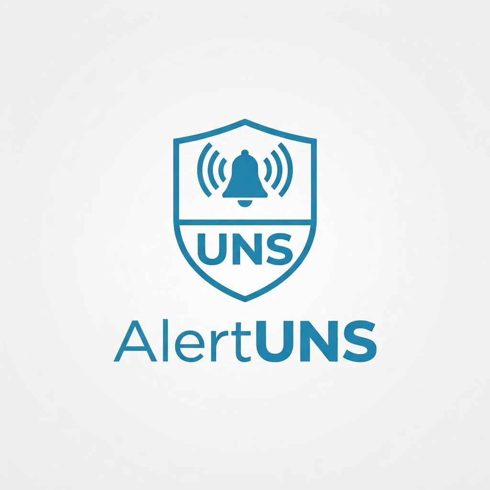

# Canal AlertUNS (Sistema de Alerta Institucional) en app [Zello](https://zello.com/es/)

# 
 

Zello es una alternativa excelente para **AlertUNS** por su gratuidad, rapidez de implementación y porque no requiere contratos corporativos ni servidores externos. Al ser un canal público dentro de la red general de Zello, opera mediante cuentas de usuario comunes de la aplicación.

A continuación, se detallan el funcionamiento, las características y la gestión administrativa del sistema de alerta institucional.

---

## 1. Jerarquía y Roles de Administración

Como creadores del canal, se asume automáticamente el rol de **Propietarios (Owners)**, otorgando el control absoluto de la estructura y seguridad de las comunicaciones.

| Rol | Privilegios y Facultades Principales |
| :--- | :--- |
| **Propietario / Administradores** | Modificar ajustes del canal, cambiar la descripción, actualizar el avatar institucional y ascender o degradar a otros usuarios. |
| **Moderadores** | Ayudar a gestionar el canal ante emergencias. Tienen la facultad de silenciar, bloquear o expulsar (*bounce*) a usuarios disruptivos. |
| **Suscriptores** | Miembros regulares (personal de seguridad de la UNS, autoridades, brigadistas) sumados a la frecuencia. |

---

## 2. Tipos de Canal y Control de Acceso

Para un sistema de alerta institucional, la selección del tipo de canal es vital para evitar interferencias o bromas. Las opciones de configuración segura son:

* **Zelect:** Permite a los nuevos usuarios unirse, pero al ingresar **solo pueden escuchar** hasta que un administrador o moderador los autorice (*confíe*) para hablar.
* **Zelect+:** Los nuevos suscriptores no pueden ni escuchar ni hablar hasta que el administrador los verifique y apruebe manualmente.
* **Protección por Contraseña:** Opción de añadir una clave para que solo ingresen quienes posean las instrucciones internas de la UNS.

---

## 3. Capacidad y Conectividad

* **Sin límite de suscriptores:** Permite incorporar a todo el personal necesario para la red institucional.
* **Límite de usuarios concurrentes:** Soporta hasta **6,000 usuarios** conectados simultáneamente hablando o escuchando en canales regulares (y hasta **8,000** en canales de solo escucha), cumpliendo ampliamente con los requerimientos universitarios.

---

## 4. Herramientas de Moderación y Seguridad en Vivo

Durante una situación de emergencia, la frecuencia debe mantenerse ordenada mediante las siguientes acciones de control:

* **Bloquear (`Block`):** Impide el acceso al canal de forma permanente o temporal.
* **Prohibir hablar (`Prohibit talking / Mute`):** Aplica un bloqueo de voz temporal (por minutos u horas) ante saturación o ruido innecesario.
* **Verificación de correo electrónico:** Requisito opcional para asegurar que los miembros tengan cuenta verificada, incrementando la trazabilidad de los participantes.

---

## 5. Difusión y Acceso Rápido

* **Enlace de Invitación y QR:** El canal genera un vínculo directo y un código QR apto para compartir rápidamente por WhatsApp, Telegram o correo institucional.
# 
 

* **Acceso Directo:** Los usuarios hacen clic en el enlace desde sus dispositivos móviles para abrir de manera directa la aplicación de Zello y solicitar su ingreso a **AlertUNS** (https://on.zello.com/bvc479).
