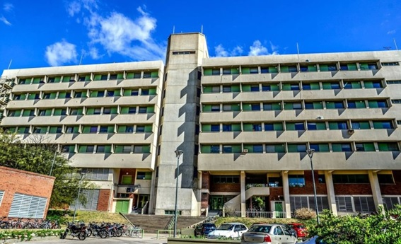
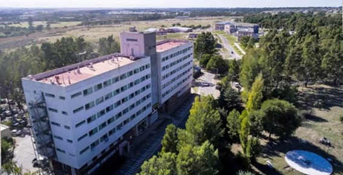
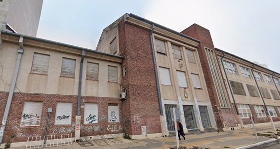
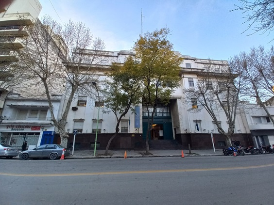

# RACUNS
## Propuesta de adquisición de equipamiento para la Expansión de Nodos Fijos, Móviles, Reserva Estratégica y Flota Táctica
**Fecha:** 19/09/2026

---

## FUNDAMENTACIÓN Y JUSTIFICACIÓN

El presente informe tiene por objeto solicitar la aprobación presupuestaria y administrativa para la adquisición de los equipos de radiocomunicaciones necesarios para materializar la **Fase 2 de despliegue de RACUNS**, en estricto cumplimiento con lo estipulado en el **Anexo Técnico de Infraestructura y Comunicaciones del Protocolo de Emergencias Climáticas de la UNS (PECl-UNS)**.

La UNS cuenta con una licencia ENACOM vigente (expediente CNC 11660/1998) y un repetidor troncal operativo en el Complejo Alem. Sin embargo, los marcos regulatorios nacionales (Ley 27.287 SINAGIR) y el Plan de Coordinación Federal ENOS 2026/2027 exigen a las instituciones críticas garantizar la redundancia, la interoperabilidad y la eliminación de "sombras radioeléctricas".

La adquisición de este equipamiento se justifica en los siguientes mandatos técnicos del Anexo Técnico:

- **Expansión de Nodos Fijos:** Edificios de gran envergadura y hormigón armado como el Rectorado (Colón 80), las Escuelas Preuniversitarias y edificio Agronomía del Campus Palihue. Se requiere la instalación de radiobases bibanda fijas en estos puntos para garantizar el reporte de estado de mayordomías y, fundamentalmente, el Protocolo de Custodia de menores.

- **Repetidor Temporal y Asistencia en Campo:** Ante la caída del repetidor de Alem por daño estructural, el protocolo exige el despliegue de una Radiobase Móvil bibanda que asuma el rol de troncal temporal en terreno y sirva de apoyo a las brigadas del nodo. Existe una redundancia temporal alternativa con la radiobase del Laboratorio de Hidráulica en la modalidad simplex VHF.

- **Reserva Estratégica:** La antena troncal de Alem está expuesta a la intemperie y a eventos de viento extremo (ráfagas >90 km/h). Contar con una antena colineal de reserva idéntica y conectores es mandatorio para cumplir con los tiempos de recuperación (RTO) de la infraestructura crítica.

- **Ampliación de Flota Táctica:** La incorporación de 6 handies adicionales permite cubrir los turnos de relevo, armar brigadas de intervención rápida y disponer de respaldo ante fallas de equipos, sin desproteger a las autoridades que se encuentran en la Sala de Crisis.

---

## DETALLE TÉCNICO Y CUADRO DE INVERSIÓN

Los valores detallados a continuación surgen de las proformas vigentes emitidas por Lagos Comunicaciones (Responsable Inscripto, proveedor habitual de la UNS) y de referencias de mercado para accesorios complementarios.

| Ítem | Descripción del Equipamiento | Cant. | P. Unitario | Subtotal | Proveedor / Origen |
|:---:|:---|:---:|:---:|:---:|:---|
| 1 | **Kit Radiobase Fija Bibanda:** Base Yedro MO4VUS 25W + Antena Colineal Aluminio Walmar SR270 + Conectores PL259. *(Destino: Nodos Colón 80, Escuelas Medias, Palihue)* | 3 | $ 447.000 | $ 1.341.000 | Lagos Comunicaciones (PF 00000295) |
| 2 | **Kit Radiobase Móvil:** Base Yedro MO4VUS 25W + Base Magnética 105mm + Antena Bi Banda. *(Destino: Vehículo de Emergencias / Repetidor Temporal)* | 1 | $ 432.000 | $ 432.000 | Lagos Comunicaciones (PF 00000297) |
| 3 | **Antena de Reserva para Troncal (Alem):** Colineal Fibra de Vidrio 3x 5/8 (4.7m). *(Destino: Stock crítico de reemplazo)* | 1 | $ 360.000 | $ 360.000 | Lagos Comunicaciones (PF 00000299) |
| 4 | **Cable Coaxil Rg213U** rollo por 100 mts. *(Destino: Fraccionamiento para bajadas de antenas en Nodos Fijos)* | 1 | $ 810.000 | $ 810.000 | Lagos Comunicaciones (PF 00000296) |
| 5 | **Fuentes de Alimentación Switching 13.8V 30A:** Entrada 220V AC / Salida 13.8V DC +-5% (30A). Chasis metálico, refrigerada por cooler, con protecciones contra cortocircuito, sobrecargas, sobretemperatura y sobretensión. *(Destino: Alimentación de las 3 bases fijas)* | 3 | $ 53.000 | $ 159.000 | MercadoLibre Romero Comunicaciones (Ref. MLA843739954) |
| 6 | **Handies Bibanda 10W (Kit c/ batería y acc.):** Baofeng UV-82 o equivalente. *(Destino: Ampliación de flota táctica y brigadas)* | 6 | $ 50.000 | $ 300.000 | MercadoLibre |
| 7 | **Caja Organizadora Plástica 26L:** Transparente, con tapa y manijas reforzadas. *(Destino: Transporte y resguardo de la flota móvil)* | 1 | $ 35.000 | $ 35.000 | Comercio Local |
| 8 | **Alargues con tomas múltiples:** Para bancos de trabajo y carga de baterías. | 2 | Gasto Menor | Gasto Menor | Comercio Local |
| | **TOTAL ESTIMADO** | | | **$ 3.437.000** | |

---

## Cableado Coaxil y Relevamiento de Instalación

Se ha cotizado la adquisición de un rollo de **100 metros de cable coaxil RG213U** de alta calidad (100% cobre), el cual será fraccionado y distribuido entre los distintos nodos según sus requerimientos técnicos.

Actualmente no se cuentan con las distancias exactas de tendido, por lo que resulta indispensable realizar un **relevamiento *in situ*** a cargo de las áreas de Telecomunicaciones e Infraestructura. Esta inspección tiene como objetivo coordinar y definir la ubicación óptima de cada radiobase dentro de los edificios, evaluando las alturas y particularidades estructurales de cada sede para planificar la bajada desde las terrazas (tal como se evidencia en el relevamiento fotográfico adjunto en el Anexo 1, destacándose las grandes alturas de edificios como el Rectorado en Colón 80 o los pabellones de Palihue).

**Previsión de metraje adicional:** Los 100 metros iniciales se asignarán de acuerdo a las mediciones reales que surjan de la inspección técnica. En caso de que el metraje resulte insuficiente para completar la totalidad de las instalaciones, se deberá adquirir cable adicional, cuyo valor de mercado de referencia es de **$ 9.000 por metro** (condición vigente, sin descuentos por la compra de rollos cerrados).

---

## CONTRAPARTES INSTITUCIONALES (SIN IMPACTO EN ESTE PRESUPUESTO)

Para que la instalación sea funcional, segura y cumpla con las normativas del Servicio de Seguridad e Higiene, se establece el siguiente esquema de trabajo, sin erogación adicional para esta propuesta:

- **Subsecretaría de Infraestructura y Servicios / Dirección de Mantenimiento:** Será responsable de la provisión e instalación de mástiles de aluminio, vientos, herrajes de fijación a techo/pared, y el pasacables/taquería necesaria para el tendido prolijo de las antenas en los nodos de Colón 80, Escuelas Medias y Palihue.

- **Laboratorio de Hidráulica:** Realizará la configuración lógica de los equipos (programación de frecuencias VHF/UHF y subtonos de privacidad según el Anexo Técnico Restringido), el ajuste de ROE (Relación de Onda Estacionaria), la integración a la subcapa de retransmisión y la capacitación a los operadores.

---

## BENEFICIOS Y CIERRE

Esta inversión de **$ 3.437.000** transforma a RACUNS de una red experimental con un solo nodo repetidor a una **Red Malla Institucional robusta, redundante y de cobertura total**.

La caída de la telefonía celular durante eventos masivos o tormentas severas (como las registradas en marzo de 2025) ya no será un factor de aislamiento para las autoridades de la UNS, los mayordomos ni los directivos de las Escuelas Preuniversitarias.

Asimismo, posiciona a la UNS en cumplimiento directo con los principios de **Autonomía Operativa** y **Redundancia** exigidos por el Plan de Telecomunicaciones Operacionales para Apoyo Federal (ENOS 2026/2027) y el SINAGIR.

---

## ANEXO 1
### Relevamiento fotográfico

- Edificio Agronomía – Campus Palihue

 

- Escuelas Medias UNS – 11 de Abril 445
  
 

- Edificio Rectorado – Colón 80
  
 

---

## ANEXO 2 – PRESUPUESTOS

Los presupuestos originales emitidos por Lagos Comunicaciones (Responsable Inscripto, CUIT 20-28566755-1) se archivan en formato PDF dentro de la carpeta `presupuestos_RACUNS/`. El presente documento no transcribe el detalle de cada proforma: se identifica número, fecha, condición y total, y se enlaza directamente al archivo original.

> **Condiciones comunes de todas las proformas:** cliente UNIVERSIDAD NACIONAL DEL SUR (CUIT 30-54666878-5); condición IVA EXENTO; condición de venta transferencia bancaria; precios y stock vigentes al día de la fecha de emisión; documento no válido como factura.

#### Proforma 00000295 - Lagos Comunicaciones
**Fecha:** 18/09/2026  
**Cliente:** UNIVERSIDAD NACIONAL DEL SUR  
**Condición:** IVA EXENTO  
**Total:** $ 1.341.000,00  
**Presupuesto original:** [presupuesto 1.pdf](presupuestos_RACUNS/1.pdf)

#### Proforma 00000296 - Lagos Comunicaciones
**Fecha:** 18/09/2026  
**Cliente:** UNIVERSIDAD NACIONAL DEL SUR  
**Condición:** IVA EXENTO  
**Total:** $ 810.000,00  
**Presupuesto original:** [presupuesto 2.pdf](presupuestos_RACUNS/2.pdf)

#### Proforma 00000297 - Lagos Comunicaciones
**Fecha:** 18/09/2026  
**Cliente:** UNIVERSIDAD NACIONAL DEL SUR  
**Condición:** IVA EXENTO  
**Total:** $ 432.000,00  
**Presupuesto original:** [presupuesto 4.pdf](presupuestos_RACUNS/4.pdf)

#### Proforma 00000299 - Lagos Comunicaciones
**Fecha:** 18/09/2026  
**Cliente:** UNIVERSIDAD NACIONAL DEL SUR  
**Condición:** IVA EXENTO  
**Total:** $ 360.000,00  
**Presupuesto original:** [presupuesto 3.pdf](presupuestos_RACUNS/3.pdf)

#### Proforma 00000298 - Lagos Comunicaciones (resumen consolidado de los ítems Lagos)
**Fecha:** 18/09/2026  
**Cliente:** UNIVERSIDAD NACIONAL DEL SUR  
**Condición:** IVA EXENTO  
**Total:** $ 2.955.600,00  
**Presupuesto original:** [presupuesto 5.pdf](presupuestos_RACUNS/5.pdf) 

**Datos para cancelación de facturas:**
- **Banco:** Galicia
- **Titular:** Alejandro Perretta
- **CUIT:** 20-28566755-1
- **ALIAS:** LAGOSCOMUNICACIONES
- **CBU:** 0070399230004002874651
- **Email:** info@lagoscomunicaciones.com.ar
- **WhatsApp:** 3413264045

**Proveedor:**
LAGOS COMUNICACIONES  
Dirección: Dercolis 230, General Lagos, Santa Fe, CP: 2126  
IVA Responsable Inscripto  
Inicio de Actividades: 06/01/2017
